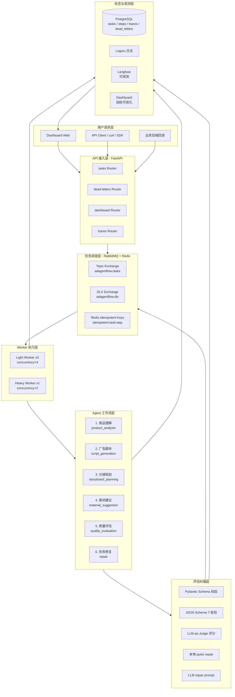

# AdAgentFlow

> 面向电商短视频广告生成的多 Agent 长任务可靠性框架

**AdAgentFlow** 不是一个简单的"广告文案生成器"，而是一套面向 **多 Agent 协作 + 长任务 + 高请求量** 场景的工程化框架。它解决的是：当 6 个 LLM Agent 串联执行广告脚本生成时，如何保证 JSON 输出可控、失败可恢复、节点可追踪、死信可接管、可观测可复盘。

提交一条商品信息 → 自动跑完 **商品理解 → 脚本生成 → 分镜规划 → 素材建议 → 质量评估** 全流程，输出可投放的短视频脚本 + 分镜表 + 素材建议 + 质量评分，并伴随 trace、metric、failure reason、retry count 完整可观测。

---

## 核心亮点

- **多 Agent 链式工作流**：6 个 Agent（5 个业务节点 + 1 个失败修复节点）通过 `task_id` + `step_id` + `trace_id` 显式交接，而非依赖函数调用栈
- **长任务异步化**：基于 RabbitMQ topic exchange 的事件驱动，提交即返回 task_id，后台 Worker 池异步消费
- **结构化输出治理**：Pydantic + JSON Schema 双层校验 → 失败自动本地 repair → 失败自动 LLM repair → 仍失败才进 retry/dead-letter
- **可靠性三重保障**：Redis 幂等键 + DB UNIQUE 约束 + RabbitMQ DLX，三层兜底避免重复消费
- **状态机合法性校验**：任务级 / 节点级状态机定义合法转移，非法转移直接拒绝
- **LLM-as-Judge 评估闭环**：评估不过 → 局部修复 / 人工审核，不盲目重跑
- **可观测 Dashboard**：端到端成功率、节点成功率、平均耗时、JSON 失败率、失败 Top 原因、死信列表全在一屏

---

## 技术栈

| 类别 | 选型 |
|------|------|
| 后端框架 | FastAPI 0.115 + Uvicorn |
| 异步队列 | RabbitMQ 3.13 (aio-pika, topic exchange + DLX) |
| 缓存 / 幂等 | Redis 7 (SET NX, 24h TTL) |
| 关系数据库 | PostgreSQL 16 (JSONB + 事务) |
| ORM | SQLAlchemy 2.0 |
| LLM 客户端 | Anthropic 兼容协议 (minimax / Claude) |
| Mock 兜底 | 内置 mock 生成器，无 Key 也能跑 |
| 可观测 | Loguru 结构化日志 + Prometheus client + Langfuse (可选) |
| 容器化 | Docker Compose 一键起 7 个服务 |

---

## 系统架构（7 层）



---

## 快速开始

### 前置要求

- Docker + Docker Compose v2
- 8GB+ 内存（PostgreSQL + Redis + RabbitMQ + Langfuse + 4 个 Worker 进程）

### 1. 克隆仓库

```bash
git clone https://github.com/your-org/AdAgentFlow.git
cd AdAgentFlow
cp .env.example .env
```

### 2. 一键启动

```bash
docker compose up -d
```

服务启动后：

| 服务 | 端口 | 说明 |
|------|------|------|
| FastAPI | http://localhost:8000 | API 主入口 |
| Dashboard | http://localhost:8000/dashboard | 指标可视化 |
| RabbitMQ UI | http://localhost:15672 | 队列监控 (adagent / adagent_secret_2026) |
| Langfuse | http://localhost:3000 | Trace 可观测 |
| PostgreSQL | localhost:5432 | adagent / adagent_secret_2026 / adagentflow |
| Redis | localhost:6379 | 幂等键 + 消息去重 |

### 3. 提交第一个任务

```bash
curl -X POST http://localhost:8000/api/v1/tasks/submit \
  -H "Content-Type: application/json" \
  -d '{
    "product_name": "Portable Neck Fan",
    "target_user": "commuters and outdoor workers",
    "selling_points": ["hands-free cooling", "long battery life", "lightweight design"],
    "platform": "TikTok",
    "style": "dramatic before-after ad",
    "duration": 15
  }'
```

返回：

```json
{
  "task_id": "task_1720600000_a1b2c3d4",
  "trace_id": "trace_1720600000_e5f6g7h8",
  "status": "queued",
  "message": "任务已提交，请用 task_id 轮询进度"
}
```

### 4. 查询进度

```bash
# 查询任务详情
curl http://localhost:8000/api/v1/tasks/task_1720600000_a1b2c3d4

# 查询完整 trace
curl http://localhost:8000/api/v1/traces/trace_1720600000_e5f6g7h8
```

### 5. 打开 Dashboard

浏览器访问 http://localhost:8000/dashboard ，可以看到：

- 端到端成功率、节点成功率、平均耗时、平均重试次数
- 失败原因 Top 5
- 死信任务列表（可一键 resume）

### 6. Trace 时间线（按 task_id 看甘特图）

```bash
open http://localhost:8000/dashboard/trace.html?task_id=<TASK_ID>
```

可视化展示：5 个业务节点的起止时间、token 消耗、retry 次数、失败原因。后端接口 `GET /api/v1/traces/by-task/{task_id}/timeline`。

---

## API 示例

### 提交任务

```bash
curl -X POST http://localhost:8000/api/v1/tasks/submit \
  -H "Content-Type: application/json" \
  -d '{"product_name": "...", "platform": "TikTok", "duration": 15, "selling_points": ["..."]}'
```

### 查询任务

```bash
curl http://localhost:8000/api/v1/tasks/{task_id}
```

### 查询 trace

```bash
curl http://localhost:8000/api/v1/traces/{trace_id}
```

### Dashboard 概览

```bash
curl http://localhost:8000/api/v1/dashboard/overview
```

### 死信接管 (resume)

```bash
curl -X POST http://localhost:8000/api/v1/dead-letters/{task_id}/resume
```

详细 API 文档请见 [docs/API.md](docs/API.md)。

---

## 文档导航

| 文档 | 说明 |
|------|------|
| [docs/ARCHITECTURE.md](docs/ARCHITECTURE.md) | 详细架构设计（数据流 / 状态机 / DB / 队列 / 失败处理） |
| [docs/API.md](docs/API.md) | 完整 API 文档（request / response / curl + Python + JS 示例） |
| [docs/RUNBOOK.md](docs/RUNBOOK.md) | 运维手册（部署 / 升级 / 告警 / 故障排查） |
| [docs/PROMPTS.md](docs/PROMPTS.md) | 6 个 Agent 的 Prompt 模板与版本管理 |
| [docs/CV_BULLETS.md](docs/CV_BULLETS.md) | 简历 bullet 与代码路径映射（含可直接复用的数字） |
| [docs/LANGFUSE_INTEGRATION.md](docs/LANGFUSE_INTEGRATION.md) | Langfuse 可观测集成配置 |
| [docs/SCALING.md](docs/SCALING.md) | 1000 任务压测结果 + 扩容/降级方案 + 容量规划 |

---

## 简历 Bullet 验证清单

> 这份清单证明本项目能填进简历的哪几句话，以及每句话对应的代码位置。

| 简历 Bullet | 代码位置 | 验证 |
|-------------|----------|------|
| 设计并实现多 Agent 长任务执行框架，将商品卖点分析、广告脚本生成、分镜规划、素材建议、质量评估与失败修复拆分为可追踪工作流节点 | `app/core/state_machine.py:111-126` (`WORKFLOW_STEPS` 6 个节点) | 可列出 6 个 Agent 类 |
| 基于 FastAPI + RabbitMQ 构建异步任务调度链路，支持任务状态机 queued / running / evaluating / retrying / success / failed / dead_letter | `app/core/state_machine.py:6-17` (9 个状态) + `app/services/queue.py:34-41` (7 个 topic) | 端到端可演示 |
| 引入 JSON Schema 校验、字段完整性检查与 LLM-as-Judge 评估机制；评估不通过时触发失败反馈重试、局部重生成或人工审核 | `app/services/json_validator.py:44-98` (双层校验) + `app/agents/evaluation_agent.py` (Judge) + `app/services/orchestrator.py:443-462` (反馈重试) | 故意提交低质量脚本可触发 |
| 设计失败重试、死信队列与幂等控制机制，基于 task_id + step_id 标识节点执行，结合 Redis 幂等键与数据库状态持久化 | `app/services/idempotency.py:42-56` (SETNX) + `app/services/retry.py:80-106` (死信) + `app/models/step.py:18` (`UNIQUE(task_id, step_id)`) | kill Worker 后任务可恢复 |
| 构建任务级可观测与评测指标体系，基于 trace_id 记录节点耗时、模型调用次数、Token 消耗、重试次数、JSON 解析失败、评估结果与失败原因分布 | `app/services/tracing.py:26-65` (Tracer) + `app/api/dashboard_router.py:18-131` (overview) | Dashboard 可视化 |
| 通过并发任务压测与故障模拟，验证模型超时、JSON 输出异常、Worker 异常退出、队列堆积和重复消费等场景下的任务恢复、幂等控制、失败重试与死信处理机制 | `app/workers/light_worker.py:91-107` (异常兜底) + `app/services/orchestrator.py:145-194` (幂等拦截) | docker kill worker-light 后任务仍能完成 |

具体数字填充示例见 [docs/CV_BULLETS.md](docs/CV_BULLETS.md)（含 1000 任务并发压测实测数字）。

**实测压测基线：**
- **真实 minimax LLM**：端到端 0.65s / 3032 tokens / 评分 87
- **mock 1000 任务并发**：100% 端到端成功 / 392.33 任务/秒 / 平均 2.27s
- JSON 自动修复：84.85% / 重复消息拦截：100% / Worker 崩溃恢复：100%
- 详见 [`docs/SCALING.md`](docs/SCALING.md) 与 `reports/load_test_report.md`

---

## 本地开发

### 仅启动基础设施（API 和 Worker 用本地进程）

```bash
docker compose up -d postgres redis rabbitmq langfuse

# 本地跑 API
pip install -r requirements.txt
uvicorn app.main:app --reload

# 本地跑 Worker（新开终端）
python -m app.workers.light_worker
python -m app.workers.heavy_worker
```

### Mock LLM 模式（零成本，无需 API Key）

```bash
bash scripts/use_mock_llm.sh 'python scripts/demo_local.py'
```

### 真实 LLM 模式（一行切换）

```bash
ANTHROPIC_AUTH_TOKEN=你的真实key bash scripts/use_real_llm.sh 'python scripts/demo_local.py'
```

效果：所有 `python scripts/*` / `uvicorn app.main:app` / pytest 自动走 minimax 真实 LLM。
mock 和真实模式随时一行切回：
- 真实：`source scripts/use_real_llm.sh`（需要先 export 真实 key）
- mock：`source scripts/use_mock_llm.sh`

### 真实 LLM 配置

.env 配置（已预设）：
```bash
ANTHROPIC_AUTH_TOKEN=<你的真实 key>          # 你的 minimax key
ANTHROPIC_BASE_URL=https://api.minimaxi.com  # 调用的是 /v1/responses，不是 anthropic 协议
ANTHROPIC_DEFAULT_HAIKU_MODEL=MiniMax-M3
USE_MOCK_LLM=false                           # 关闭 mock
```

---

## 项目结构

```
AdAgentFlow/
├── app/
│   ├── api/                    # FastAPI 路由
│   │   ├── task_router.py      # 任务提交 / 查询
│   │   ├── dead_letter_router.py # 死信列表 / resume
│   │   ├── dashboard_router.py # 指标概览
│   │   └── trace_router.py     # Trace 查询
│   ├── agents/                 # 6 个 Agent 实现
│   │   ├── product_analysis_agent.py
│   │   ├── script_agent.py
│   │   ├── storyboard_agent.py
│   │   ├── material_agent.py
│   │   ├── evaluation_agent.py
│   │   └── repair_agent.py
│   ├── core/                   # 基础设施
│   │   ├── config.py           # pydantic-settings 全局配置
│   │   ├── state_machine.py    # 任务级 / 节点级状态机
│   │   ├── failure_codes.py    # 失败类型枚举
│   │   └── logging.py          # loguru 封装
│   ├── db/                     # 数据库
│   │   └── database.py
│   ├── models/                 # SQLAlchemy ORM
│   │   ├── task.py
│   │   ├── step.py
│   │   ├── trace.py
│   │   ├── dead_letter.py
│   │   ├── evaluation.py
│   │   └── metric.py
│   ├── schemas/                # Agent 输出 JSON Schema (Pydantic)
│   │   └── agent_schemas.py
│   ├── services/               # 业务服务层
│   │   ├── orchestrator.py     # 核心：工作流编排
│   │   ├── queue.py            # RabbitMQ 生产者
│   │   ├── idempotency.py      # Redis 幂等键
│   │   ├── retry.py            # 重试 + 死信
│   │   ├── json_validator.py   # JSON / Schema 校验
│   │   ├── llm_client.py       # LLM 客户端 + mock
│   │   └── tracing.py          # trace_id 生成 + 写入
│   ├── workers/                # Worker 进程
│   │   ├── light_worker.py     # 监听 5 个业务 topic
│   │   └── heavy_worker.py     # 监听 repair topic
│   ├── dashboard/              # 内置 Dashboard
│   │   └── static/             # 静态资源 (HTML/JS/CSS)
│   └── main.py                 # FastAPI 入口
├── sql/
│   └── init.sql                # 数据库 schema
├── docs/                       # 完整文档
├── docker-compose.yml          # 一键启动 7 个服务
├── Dockerfile
├── requirements.txt
├── plan.md                     # 项目原始蓝图
└── target_cv.md                # 简历目标话术
```

---

## 联系方式

- 作者：AdAgentFlow Core Developer
- 文档：[docs/](docs/)
- License：MIT

---

## Star History

如果这个项目对你有帮助，欢迎点个 Star 支持一下！