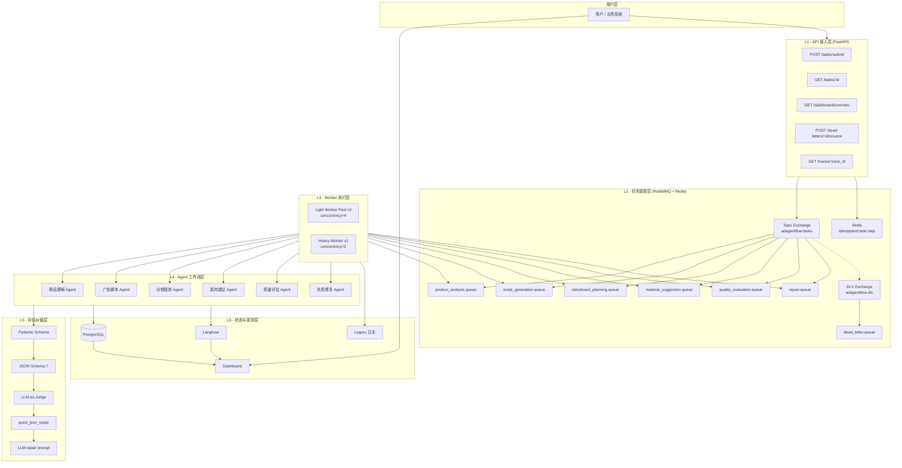
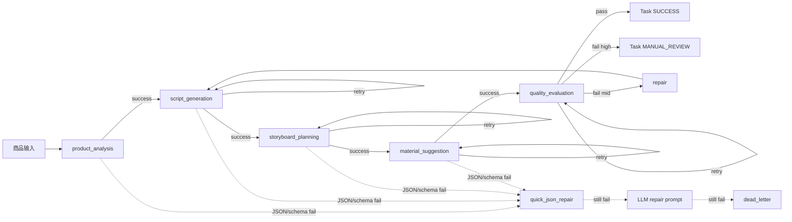
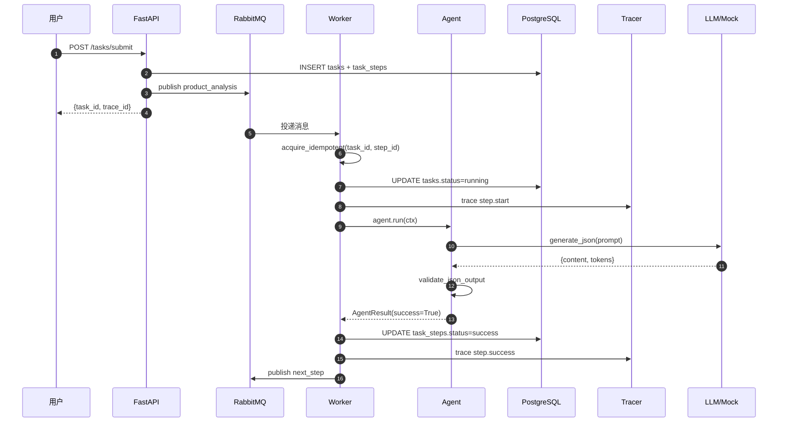
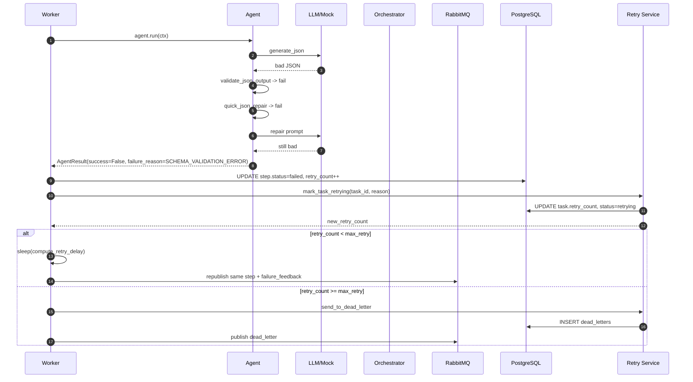
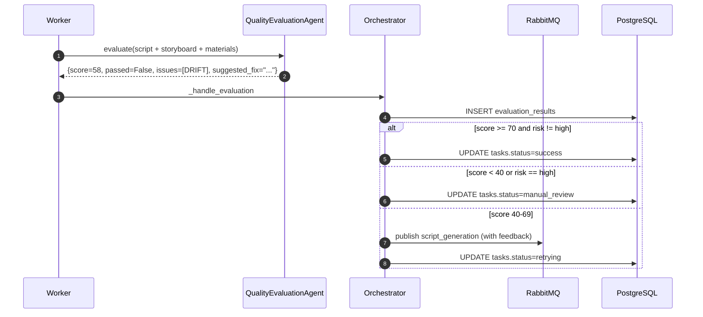
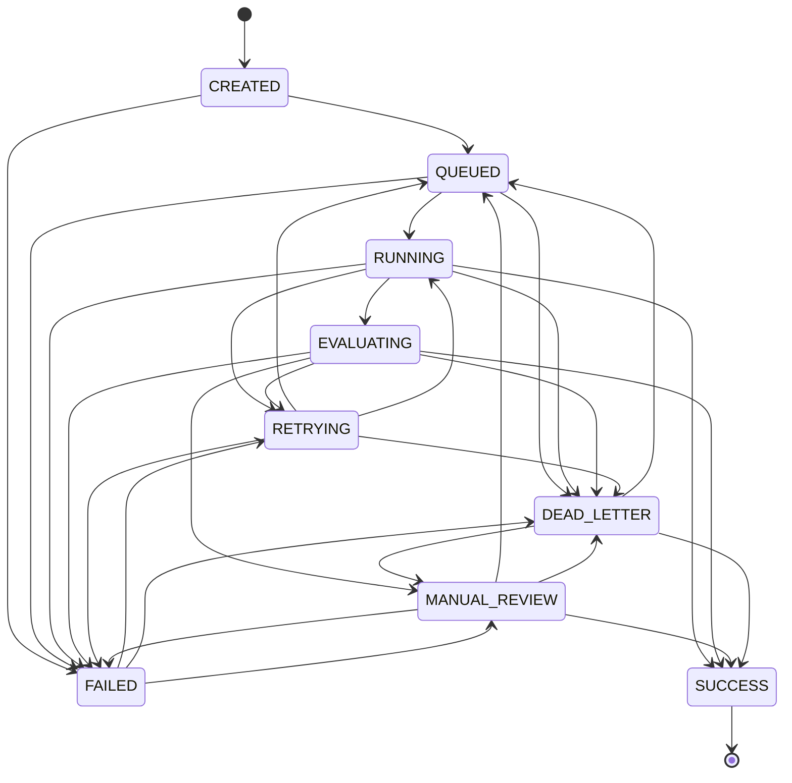
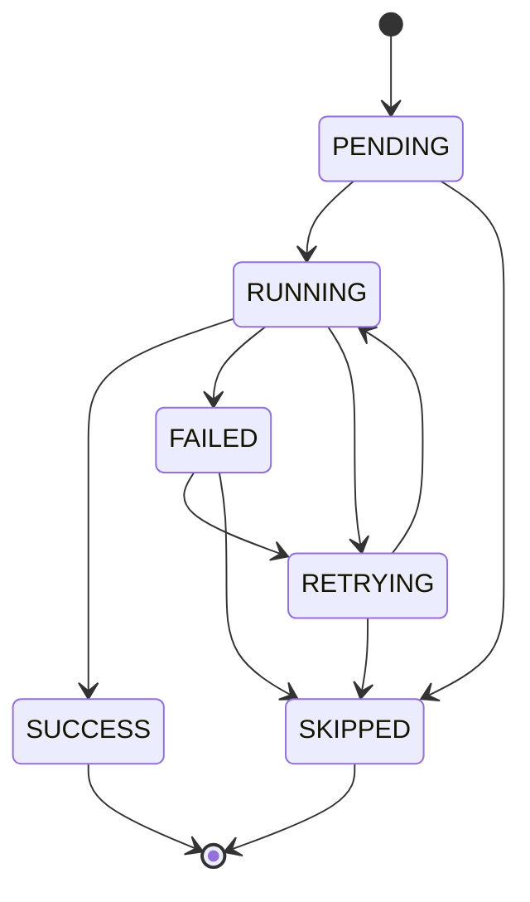
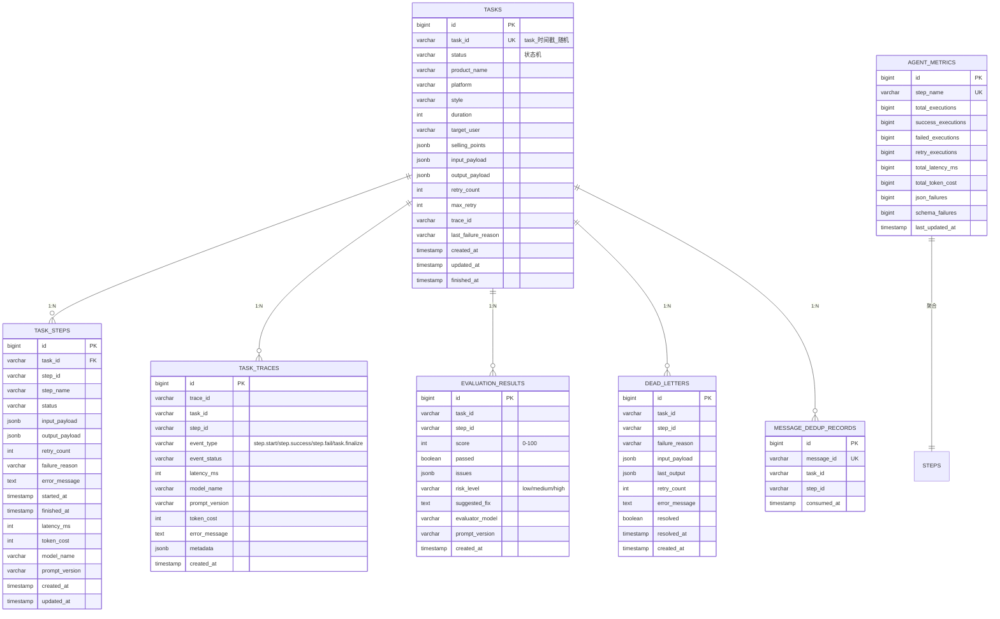

# AdAgentFlow 架构设计

> 本文档详细描述 AdAgentFlow 的分层架构、数据流、状态机、数据库设计、队列设计、失败处理、幂等控制、可观测性。

---

## 1. 整体架构（分层 + 链式）

### 1.1 分层架构图



### 1.2 链式工作流

工作流是显式的 6 个 step（5 业务 + 1 修复），每个 step 完成后由 orchestrator 决定下一步。



代码位置：

- 链定义：`app/core/state_machine.py:111-126`
- 链式推进：`app/services/orchestrator.py:257-268` (`next_step_or_done` + `publish_step`)

---

## 2. 数据流（消息如何在 Agent 间流转）

### 2.1 正常链路



### 2.2 失败重试链路



### 2.3 评估反馈链路



---

## 3. 状态机

### 3.1 任务级状态机



代码定义：`app/core/state_machine.py:34-56`

### 3.2 节点级状态机



代码定义：`app/core/state_machine.py:59-66`

### 3.3 状态机校验

每次状态转移都通过 `assert_transition_task` / `assert_transition_step` 校验，非法转移会被记录 warning 并拒绝写入。这避免：

- 任务在 SUCCESS 后又跑回 RUNNING（重复执行）
- 节点从 PENDING 直接跳到 SUCCESS（漏跑）
- 任务状态乱序（消息重排导致）

---

## 4. 数据库设计

### 4.1 ER 图



### 4.2 表字段说明

详见 [sql/init.sql](../sql/init.sql)。

关键设计：

- `task_steps` 用 `UNIQUE(task_id, step_id)` 约束防止重复写入
- `tasks.input_payload` 和 `tasks.output_payload` 是 JSONB，可直接存结构化数据
- `task_traces.metadata` 是 JSONB，用于存扩展上下文
- `agent_metrics` 是聚合表，每个 step_name 一行，O(1) 查 Dashboard
- `dead_letters.resolved` 标记是否已人工接管

---

## 5. 队列设计

### 5.1 Topic 列表

| Topic | 说明 | 消费者 |
|-------|------|--------|
| `ad_task.created` | 新任务入口 | (预留) |
| `ad_task.product_analysis` | 商品理解 | Light Worker |
| `ad_task.script_generation` | 广告脚本 | Light Worker |
| `ad_task.storyboard_planning` | 分镜规划 | Light Worker |
| `ad_task.material_suggestion` | 素材建议 | Light Worker |
| `ad_task.quality_evaluation` | 质量评估 | Light Worker |
| `ad_task.repair` | 失败修复 | Heavy Worker |
| `ad_task.dead_letter` | 死信 | (预留) |

### 5.2 队列声明

每个工作队列都有：

```python
{
    "x-dead-letter-exchange": "adagentflow.dlx",
    "x-dead-letter-routing-key": "ad_task.dead_letter",
}
```

代码：`app/services/queue.py:79-89`

### 5.3 消息格式

```json
{
  "task_id": "task_1720600000_a1b2c3d4",
  "step_id": "script_generation",
  "payload": {
    "task_id": "task_...",
    "trace_id": "trace_...",
    "product": {...},
    "history": {"product_analysis": {...}},
    "attempt": 1,
    "failure_feedback": ""
  },
  "ts": 12345.67
}
```

---

## 6. 失败处理策略矩阵

| 失败类型 | enum 值 | 处理策略 | 实现位置 |
|---------|---------|---------|---------|
| JSON 解析失败 | `JSON_PARSE_ERROR` | quick_json_repair → LLM repair → 重试 | `agents/base.py:89-145` |
| Schema 校验失败 | `SCHEMA_VALIDATION_ERROR` | 带错误反馈重试（repair prompt） | `services/json_validator.py:84-95` |
| 卖点偏移 | `SELLING_POINT_DRIFT` | 触发 repair agent 重写脚本 | `agents/evaluation_agent.py:50-71` |
| 分镜缺失 | `STORYBOARD_MISSING` | 重试 storyboard_planning | `services/orchestrator.py:310-311` |
| 内容过长 | `CONTENT_TOO_LONG` | repair agent 压缩脚本 | `core/failure_codes.py:21-34` |
| 模型超时 | `MODEL_TIMEOUT` | 指数退避重试，可切换模型 | `services/retry.py:27-37` |
| Judge 拒绝 | `JUDGE_REJECTED` | 局部重生成 / 人工审核 | `services/orchestrator.py:400-441` |
| Worker 崩溃 | `WORKER_CRASH` | 从 DB 恢复状态机 | `services/retry.py:80-106` |
| 重复消息 | `DUPLICATE_MESSAGE` | Redis 幂等键拦截 | `services/idempotency.py:42-56` |
| 未知错误 | `UNKNOWN_ERROR` | 记录后进死信 | `core/failure_codes.py:32` |

代码定义：`app/core/failure_codes.py:5-34`

---

## 7. 幂等控制原理

### 7.1 两层幂等

**Redis 层（主）**：

```python
# app/services/idempotency.py:42-56
async def acquire_idempotent(task_id: str, step_id: str, *, ttl=None) -> bool:
    key = f"idempotent:{task_id}:{step_id}"
    marker = json.dumps({"ts": int(time.time()), "step_id": step_id})
    res = await r.set(name=key, value=marker, nx=True, ex=ttl)
    return bool(res)
```

- 使用 `SET ... NX EX 86400` 原子操作
- 24 小时 TTL，过期后自动释放（允许人工重跑）
- 返回 True 表示首次执行，False 表示已被占

**DB 层（兜底）**：

```sql
-- app/models/step.py:18
__table_args__ = (UniqueConstraint("task_id", "step_id", name="uq_task_step"),)
```

- 即便 Redis 挂了，DB UNIQUE 约束也会阻止重复写
- 写入失败由 ORM 抛 IntegrityError，被 base agent 吞掉

### 7.2 消息级去重

除节点级幂等外，Worker 在处理消息前还会检查 `message_id`：

```python
# app/services/idempotency.py:71-92
async def mark_message_seen(message_id: str) -> bool:
    res = await r.set(name=f"dedup:msg:{message_id}", value="1", nx=True, ex=3600)
    if not res:
        # DB 兜底
        ...
```

这能拦截 RabbitMQ 由于网络重试投递的相同 message_id。

### 7.3 为什么这样设计

- **Worker 崩溃恢复**：Worker 处理到一半崩溃，任务状态留在 running；另一个 Worker 重新消费时，Redis 键已过期（24h）或被新 Worker 占
- **消息重投**：RabbitMQ 在网络闪断时会重投相同 message，靠 dedup 拦截
- **业务幂等**：同一个 task + step 多次执行不会写脏数据

---

## 8. 重试与退避

### 8.1 退避策略

```python
# app/services/retry.py:27-37
def compute_retry_delay(retry_count: int) -> int:
    delays = settings.retry_delay_list  # 默认 [0, 5, 15]
    idx = min(retry_count, len(delays) - 1)
    return delays[idx]
```

| 第 N 次重试 | 延迟 |
|------------|------|
| 1 | 0s（立即） |
| 2 | 5s |
| 3 | 15s |
| >3 | 进 dead_letter |

### 8.2 退避实现

退避在 `_schedule_retry` 中用 `asyncio.create_task + asyncio.sleep` 实现，**不阻塞 Worker 主循环**：

```python
# app/services/orchestrator.py:336-347
async def _delayed_publish():
    await asyncio.sleep(delay)
    next_payload = dict(payload)
    next_payload["attempt"] = new_retry_count + 1
    next_payload["failure_feedback"] = ...
    await self.queue.publish_step(task_id, step_id, next_payload)

asyncio.create_task(_delayed_publish())
```

### 8.3 死信判定

```python
# app/services/retry.py:36-37
def should_retry(retry_count: int, max_retry: int) -> bool:
    return retry_count < max_retry
```

超过 max_retry（默认 3）后，调用 `send_to_dead_letter`：

- 写 `dead_letters` 表
- 任务状态置为 `dead_letter`
- 发消息到 `ad_task.dead_letter`

人工可以通过 `POST /api/v1/dead-letters/{task_id}/resume` 接管，reset retry_count 重新派发。

---

## 9. 可观测性

### 9.1 Trace 设计

每个任务一个 `trace_id`，跨节点关联：

```
trace_1720600000_e5f6g7h8
  ├─ step.start: product_analysis
  ├─ step.success: product_analysis (latency=2300ms, model=MiniMax-M3, prompt_version=v1.1)
  ├─ step.start: script_generation
  ├─ step.success: script_generation (latency=4100ms)
  ├─ step.fail: storyboard_planning (failure_reason=SCHEMA_VALIDATION_ERROR)
  ├─ step.start: storyboard_planning (attempt=2)
  ├─ step.success: storyboard_planning
  ├─ ...
  └─ task.finalize: success (score=87)
```

代码：`app/services/tracing.py:26-65`

### 9.2 三类可观测数据

| 类型 | 内容 | 存储 |
|------|------|------|
| **Logs** | 结构化日志（trace_id / task_id / step_id / level） | Loguru → stdout + `logs/adagentflow_*.log` (100MB rotation, 30 天) |
| **Traces** | 节点级事件（开始/成功/失败/最终化） | `task_traces` 表 + Langfuse |
| **Metrics** | 聚合指标（端到端成功率、节点成功率、平均耗时） | `agent_metrics` 表 + Dashboard API + Prometheus |

### 9.3 Dashboard 指标

`GET /api/v1/dashboard/overview` 返回：

```json
{
  "task_summary": {
    "total_tasks": 1234,
    "success": 1172,
    "failed": 12,
    "dead_letter": 8,
    "running": 42,
    "end_to_end_success_rate": 94.97
  },
  "performance": {
    "avg_latency_seconds": 18.3,
    "avg_retry_count": 0.42,
    "total_llm_calls": 6170,
    "json_failure_rate": 4.8,
    "dead_letter_rate": 0.65,
    "avg_quality_score": 82.5,
    "judge_pass_rate": 91.2
  },
  "node_success_rates": [...],
  "failure_top_5": [...],
  "unresolved_dead_letters": [...]
}
```

代码：`app/api/dashboard_router.py:18-131`

---

## 10. 设计权衡

### 10.1 为什么用异步队列而不是直接 await

LLM 调用 2-5s 一次，5 个节点串联就是 10-25s。如果用同步 await，HTTP 请求会超时。多 Worker 并行消费才能支持并发提交 100+ 任务。

### 10.2 为什么用状态机而不是标志位

状态机让非法转移（如 SUCCESS → RUNNING）在编译期就被禁止，避免分布式场景下的状态乱序。标志位无法表达"已经成功不能再次执行"的约束。

### 10.3 为什么不用框架内置的 retry

Celery / Dramatiq 的 retry 不能针对每个节点失败类型定制策略。本项目要按 failure_reason 决定 repair / retry / dead_letter，必须自己实现。

### 10.4 为什么用 Pydantic + JSON Schema 双层

- Pydantic 校验类型 + 约束（min_length / ge / le）
- JSON Schema 7 给 LLM 当 prompt 参数，让它知道要输出什么形状
- 双层校验覆盖率 100%，且 Pydantic 失败信息更友好

---

## 附录：模块文件清单

| 模块 | 路径 |
|------|------|
| 状态机 | `app/core/state_machine.py` |
| 失败码 | `app/core/failure_codes.py` |
| 配置 | `app/core/config.py` |
| 编排器 | `app/services/orchestrator.py` |
| 队列 | `app/services/queue.py` |
| 幂等 | `app/services/idempotency.py` |
| 重试 | `app/services/retry.py` |
| JSON 校验 | `app/services/json_validator.py` |
| LLM 客户端 | `app/services/llm_client.py` |
| Trace | `app/services/tracing.py` |
| Agent 基类 | `app/agents/base.py` |
| Worker | `app/workers/light_worker.py`, `app/workers/heavy_worker.py` |
| ORM 模型 | `app/models/*.py` |
| API 路由 | `app/api/*.py` |
| Dashboard | `app/dashboard/static.py` + `app/api/dashboard_router.py` |